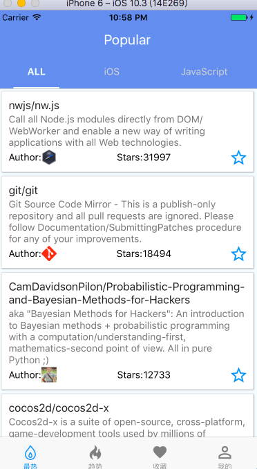
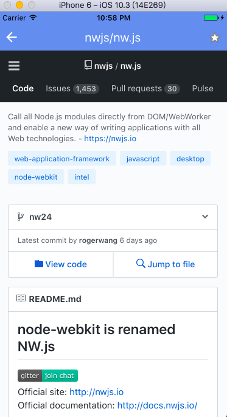
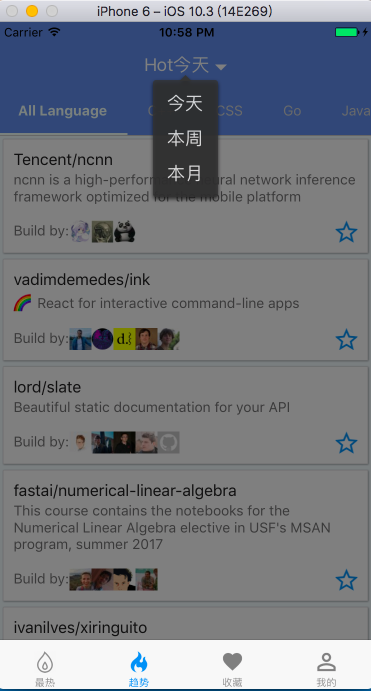
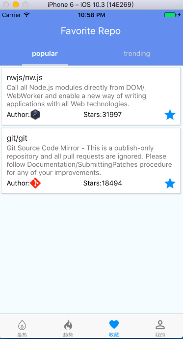
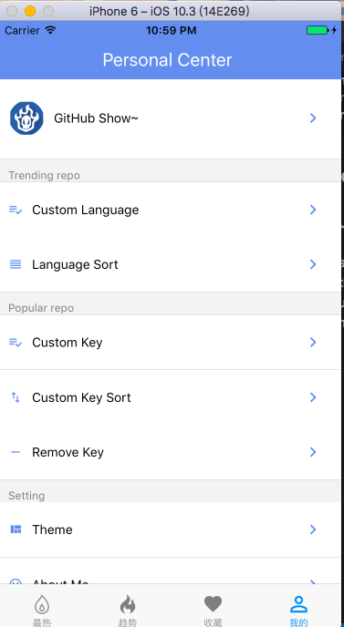
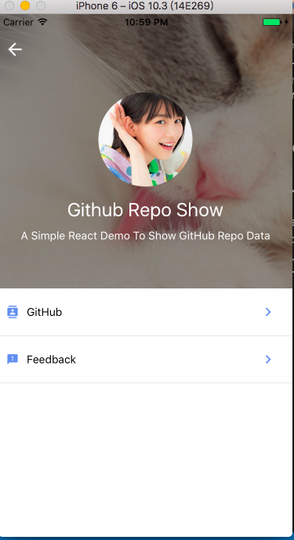
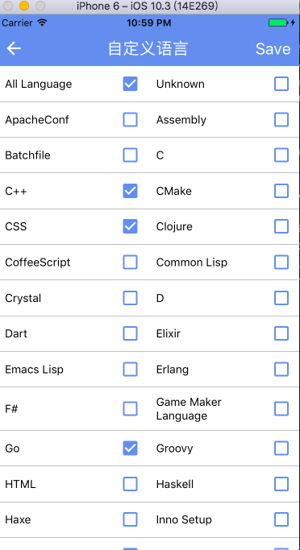
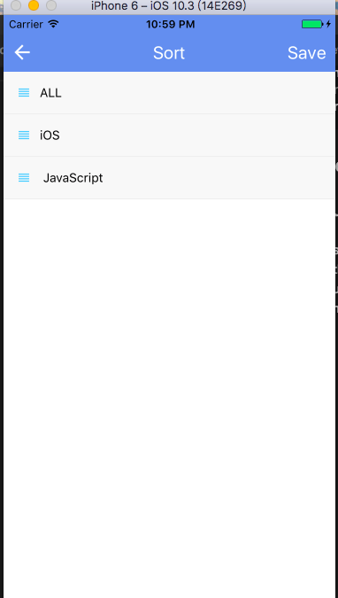
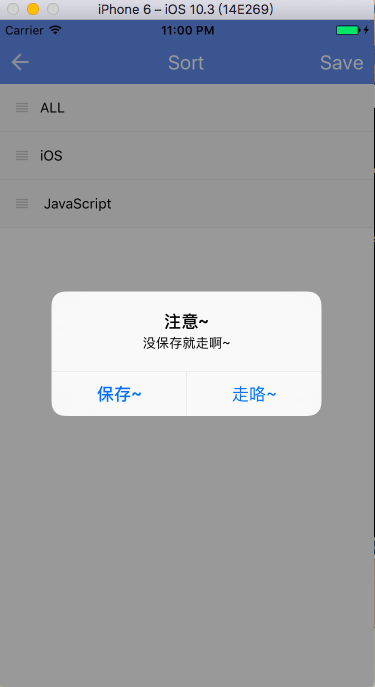
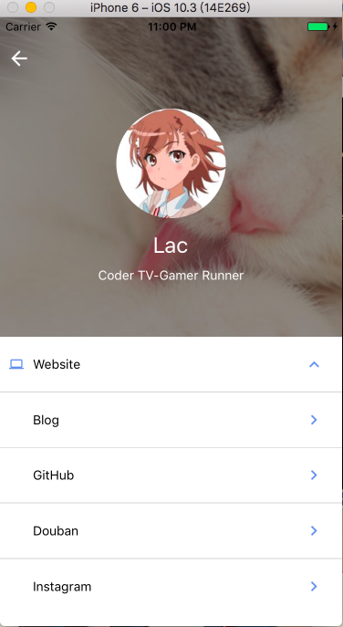

# GitHub Show
 A React Native App（IOS/Android) power by GitHub API
 - Popular Repo list
 - Trending Repo list
 - Favorite Repo list
 - Setting 
  (custom language/language sort in Trending;custom key/key sort/remove key in Popular;About this Project and About me)

## Stack
- react-native
- react-native-check-box
- react-native-easy-toast
- react-native-htmlview
- react-native-parallax-scroll-view
- react-native-scrollable-tab-view
- react-native-sortable-listview
- react-native-tab-navigator

## Build Setup
```bash
#install react-native first
$ npm i react-native -g
# git clone
$ git clone https://github.com/laclys/github_show.git
# cd project
$ cd github_show
# install dependencies
$ npm install
# run
$ react-native run-ios/run-android
```
## Demo Pic




















## Features
- search
- theme setting
- update RN0.46
- make App beautiful